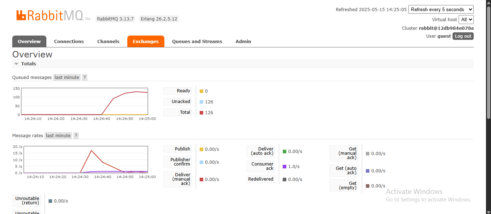
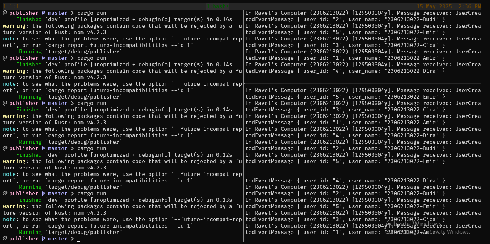
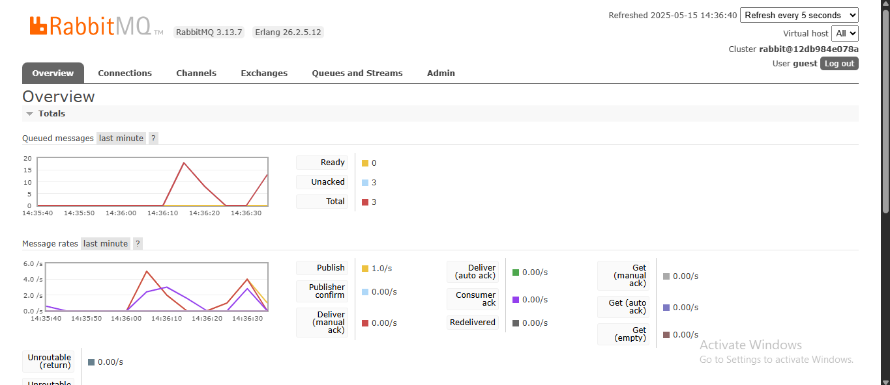

# Module 10 AdvProg

Name: Carleano Ravelza Wongso
NPM: 2306213022

## Questions

a. What is AMQP?
AMQP (Advanced Message Queuing Protocol) is a standardized application-layer protocol designed for message-oriented middleware. It facilitates the exchange of messages between various applications or services through a message broker, ensuring efficient and dependable message delivery.

b. What does it mean? guest:guest@localhost:5672 , what is the first guest, and what is the second guest, and what is localhost:5672 is for?
The first "guest" represents the username, while the second "guest" is the corresponding password used for authentication. "localhost:5672" specifies the server address and port with "localhost" indicating the RabbitMQ server is hosted on the local machine, and "5672" being the default port used for AMQP communication.

## Screenshot of Slow Subscriber

According to the image below, the number of peak queue is ~130. This could happen because eEach message takes at least 1 second to process due to the thread::sleep(ten_millis) call. If messages are being published faster than once per second, they will naturally pile up in the queue because:

- Publisher: Can send messages without waiting
- Subscriber: Takes 1 second per message to process

## Screenshot of Running Three Subscribers

Here i running three subscribers with the same amount of message i sent from publishers. The chart show that we successfully reduced the number of queue. This could happen because each subscriber can process messages in parallel, effectively distributing the workload. Each subscriber independently processes messages from the same queue, allowing for concurrent message handling, so instead of 1 message per second, we doing 3 messages per second.

